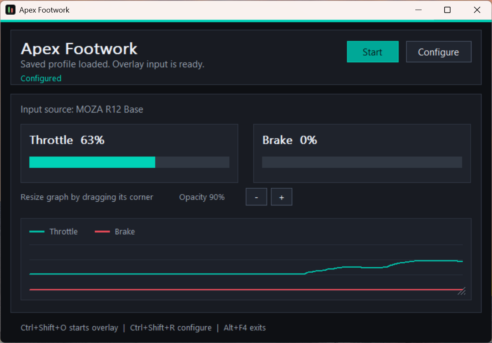

# Apex Footwork



Apex Footwork is a native Windows utility for mapping a pedal device to throttle and brake inputs, then monitoring those inputs in a lightweight on-screen overlay.

The app walks through device selection, throttle detection, brake detection, and then shows live pedal values with a combined history graph.

## Important: unsigned application

This project is not code-signed yet.

Windows SmartScreen, antivirus software, or browser download protection may warn that the app or installer is from an unknown publisher. That is expected for the current builds. Treat releases as unsigned development builds until a signing certificate and release signing process are added.

## Features

- Detects joystick/HID devices through the Windows multimedia joystick API.
- Captures throttle and brake axes automatically from pedal movement.
- Supports a recommended driver-range mode and an advanced custom 0-100% calibration mode.
- Saves the selected device and bindings to a local profile.
- Restores the saved profile on startup when the device is connected.
- Provides a movable overlay with live throttle/brake bars and history graph.
- Embeds the project icon into the app binary, installer, uninstaller, and Start Menu shortcuts.

## Usage

1. Connect the pedal/controller device.
2. Launch Apex Footwork.
3. Select the controller that owns the pedals.
4. Click `Use device`.
5. Release all pedals, then click `Capture Throttle`.
6. Press and release the throttle pedal.
7. Repeat the capture flow for the brake pedal.
8. Click `Start` to open the overlay.

Useful shortcuts:

- `Enter`: confirm the current setup step.
- `Ctrl+Shift+O`: start or stop the overlay when configured.
- `Ctrl+Shift+R`: return to configuration.
- `Alt+F4`: exit.

## Saved profile

The profile is stored per user:

```text
%APPDATA%\ApexFootwork\profile.txt
```

If `%APPDATA%` is unavailable, the app falls back to `%LOCALAPPDATA%`, then the current working directory.

## Build requirements

- Windows
- Rust toolchain with Cargo
- Windows SDK resource compiler, `rc.exe`
- NSIS with `makensis.exe` available in `PATH` for installer builds

MSVC Windows builds link the Visual C++ runtime statically via `.cargo/config.toml`,
so release builds do not require users to install the Microsoft Visual C++
Redistributable separately.

## Build the app

```powershell
cargo build --release
```

The release binary is written to:

```text
target\release\apex_footwork.exe
```

## Build the installer

```powershell
powershell -ExecutionPolicy Bypass -File scripts\build-installer.ps1
```

The installer is written to:

```text
dist\ApexFootwork-<version>-setup.exe
```

The installer currently installs per user into:

```text
%LOCALAPPDATA%\Programs\ApexFootwork
```

## Project layout

```text
apex-footwork.ico              Application and installer icon
build.rs                       Windows resource embedding for the app binary
src\main.rs                    Win32 UI, overlay, device polling, app entry point
src\wizard.rs                  Device selection and pedal capture workflow
src\profile.rs                 Saved profile serialization and loading
installer\apex-footwork.nsi    NSIS installer script
scripts\build-installer.ps1    Release and installer build script
```

## Release notes

Current builds are development builds and are not signed.
